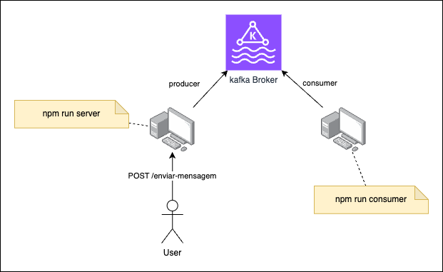

# Kafka Playground

## Sumário

- [Estrutura do projeto](#estrutura-do-projeto)
- [Configurações](#configurações)
- [Windows](#windows)
  - [Zookeeper](#zookeeper)
  - [Kafka Broker](#kafka-broker)
  - [Criar novo tópico](#criar-um-novo-tópico)
  - [Primeiros testes](#primeiros-testes)
    - [Producer](#producer)
    - [Consumer](#consumer)
- [Linux/macOS](#linuxmacos)
  - [Zookeeper](#zookeeper-1)
  - [Kafka Broker](#kafka-broker-1)
  - [Criar novo tópico](#criar-um-novo-tópico-1)
  - [Primeiros testes](#primeiros-testes-1)
    - [Producer](#producer-1)
    - [Consumer](#consumer-1)  

## Estrutura do projeto

O projeto de exemplo consiste em uma aplicação que disponibiliza um enpoint `POST /enviar-mensagem` e publica uma mensagem no stream de eventos.

Além disso, temos um módulo que consome todos os eventos publicados.

A Figura a seguir apresenta um esquema deste projeto:



## Configurações

Faça o download do [Apache Kafka](https://www.apache.org/dyn/closer.cgi?path=/kafka/3.6.0/kafka_2.13-3.6.0.tgz).

- Windows: descompate os arquivos na pasta `C:\kafka`.
- Linux/macOS: descompate os arquivos na pasta `~/kafka`.

## Windows

### Zookeeper

Modifique a propriedade `dataDir` do arquivo `config\zookeeper.properties` para:

```
dataDir=C:\kafka\zookeeper-data
```

Inicialize o serviço executando o comando:

```
cd C:\kafka
.\bin\windows\zookeeper-server-start.bat .\config\zookeeper.properties
```

### Kafka Broker

Modifique as seguintes propriedades do arquivo `config\server.properties` para:

```
log.dirs=C:\kafka\kafka-logs
offsets.topic.num.partitions=1
log.segment.bytes=20000000
```

Inicialize o serviço executando o comando:

```
cd C:\kafka
.\bin\windows\kafka-server-start.bat .\config\server.properties
```

### Criar um novo tópico

```
cd C:\kafka
.\bin\windows\kafka-topics.bat --create --topic meu-topico --bootstrap-server localhost:9092
```

### Primeiros testes

#### Producer

```
cd C:\kafka
.\bin\windows\kafka-console-producer.bat --topic meu-topico --bootstrap-server localhost:9092
```

#### Consumer

```
cd C:\kafka
.\bin\windows\kafka-console-consumer.bat --topic meu-topico --from-beginning --bootstrap-server localhost:9092
```

## Linux/macOS

### Zookeeper

Modifique a propriedade `dataDir` do arquivo `config\zookeeper.properties` para:

```
dataDir=./zookeeper-logs
```

Inicialize o serviço executando o comando:

```
cd ~/kafka
./bin/zookeeper-server-start.sh ./config/zookeeper.properties
```

### Kafka Broker

Modifique as seguintes propriedades do arquivo `config\server.properties` para:

```
log.dirs=./kafka-logs
offsets.topic.num.partitions=1
log.segment.bytes=20000000
```

Inicialize o serviço executando o comando:

```
cd ~/kafka
./bin/kafka-server-start.sh ./config/server.properties
```

### Criar um novo tópico

```
cd ~/kafka
./bin/kafka-topics.sh --create --topic meu-topico --bootstrap-server localhost:9092
```

### Primeiros testes

#### Producer

```
cd ~/kafka
./bin/kafka-console-producer.sh --topic meu-topico --bootstrap-server localhost:9092
```

#### Consumer

```
cd ~/kafka
./bin/kafka-console-consumer.sh --topic meu-topico --from-beginning --bootstrap-server localhost:9092
```

## Referências
- [Apache Kafka Quickstart](https://kafka.apache.org/quickstart)
- [Download Kafka](https://www.apache.org/dyn/closer.cgi?path=/kafka/3.6.0/kafka_2.13-3.6.0.tgz)
- [KafkaJS library](https://kafka.js.org/)